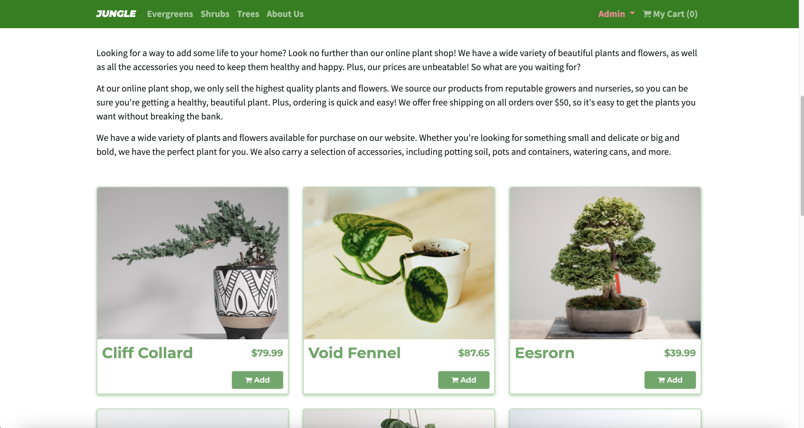
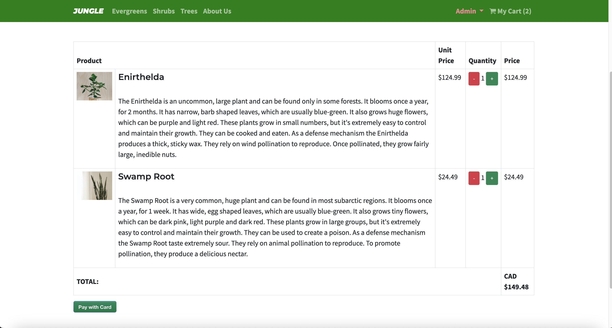

# Jungle

Jungle is a Ruby on Rails 6.1 mini e-commerce application designed to offer users a seamless shopping experience for home plants. The app combines robust user authentication with an intuitive interface, enabling users to browse, purchase, and manage their plant collections with ease. For administrators, Jungle provides the tools to manage inventory, update product information, and categorize plants efficiently.

## Key features

- Browse Plants: View all available plants on the homepage, complete with detailed descriptions and pricing.
- User Authentication: Secure user registration and login, ensuring personalized shopping experiences.
- Admin Controls: Admins can add new plants, update existing ones, or remove them from the store.
- Stock Management: Products display a "Sold Out" badge when out of stock, and these items cannot be added to the cart.
- Categorization: Easily navigate through different plant categories, allowing users to find their desired plants quickly.
- Responsive Design: Enjoy a consistent and smooth user experience across all devices.

# Screenshots

## Setup

1. Run `bundle install` to install dependencies
2. Create `config/database.yml` by copying `config/database.example.yml`
3. Create `config/secrets.yml` by copying `config/secrets.example.yml`
4. Run `bin/rails db:reset` to create, load and seed db
5. Create .env file based on .env.example
6. Sign up for a Stripe account
7. Put Stripe (test) keys into appropriate .env vars
8. Run `bin/rails s -b 0.0.0.0` to start the server

## Database

If Rails is complaining about authentication to the database, uncomment the user and password fields from `config/database.yml` in the development and test sections, and replace if necessary the user and password `development` to an existing database user.

## Stripe Testing

Use Credit Card # 4111 1111 1111 1111 for testing success scenarios.

More information in their docs: <https://stripe.com/docs/testing#cards>

## Dependencies

- Rails 6.1 [Rails Guide](http://guides.rubyonrails.org/v6.1/)
- Bootstrap 5
- PostgreSQL 9.x
- Stripe
